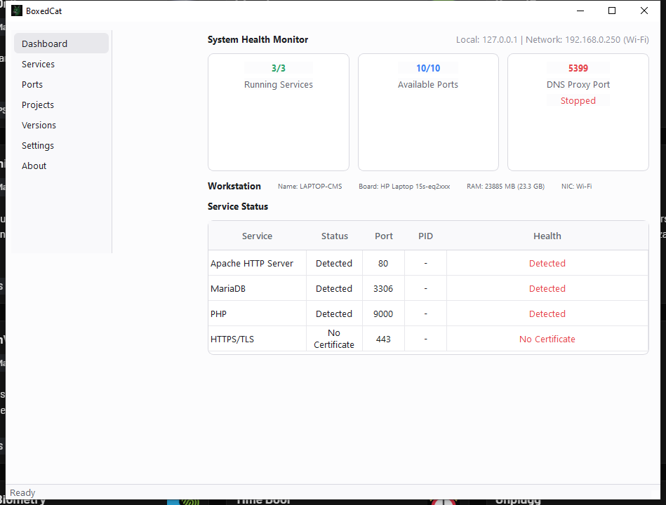

# BoxedCat

A standalone local dev environment manager built with **Rust + Qt 6**.

BoxedCat manages Apache, MariaDB, PHP, and more from a single portable directory. No XAMPP, no WAMP, no bloat.



## Features

- **Dashboard** — SIEM-style health monitor with service status, port scan, DNS proxy, and hardware info
- **Services** — Start/Stop/Restart Apache, MariaDB, PHP, HTTPS/TLS with one click
- **Ports** — Real-time port scanning with process identification
- **Projects** — Auto-scan `www/` for projects with vhost management
- **Versions** — Download and deploy Apache, MariaDB, PHP, PostgreSQL, Nginx, Redis
- **Settings** — Server directory, DNS proxy, auto-start, theme toggle
- **HTTPS/TLS** — Self-signed certificate generation for localhost development
- **DNS Proxy** — Resolves `*.test` domains to `127.0.0.1` on port 5399

## Architecture

```
boxedcat.exe          ← C++ main entry (Qt GUI + Rust FFI)
├── libboxedcat.a     ← Rust static library (services, ports, DNS, TLS)
├── apache/           ← Apache HTTP Server
├── php/              ← PHP runtime
├── mysql/            ← MariaDB
├── certs/            ← TLS certificates
└── www/              ← DocumentRoot
```

## Tech Stack

| Component | Technology |
|-----------|------------|
| GUI | Qt 6.7.3 (Widgets, QSS) |
| Core | Rust (windows-sys, rcgen, serde) |
| Build | MinGW 11.2.0 (WinLibs) |
| HTTP | Apache 2.4.66 + OpenSSL 4.0.2 |
| Database | MariaDB 11.4.13 |
| Language | PHP 8.5.10 |

## Building

### Prerequisites

- Rust toolchain (`x86_64-pc-windows-gnu` target)
- MinGW 11.2.0 (WinLibs MSVCRT)
- Qt 6.7.3 (MinGW)

### Build Commands

```bash
# Build Rust core
cargo build --release --target x86_64-pc-windows-gnu

# Compile Qt resources
rcc app.qrc -o app_generated.cpp
g++ -c app_generated.cpp -I"C:\Qt\6.7.3\mingw_64\include"

# Link final executable
g++ -mwindows -o boxedcat.exe cpp/main.cpp app_generated.o \
    -I"C:\Qt\6.7.3\mingw_64\include" \
    -L"C:\Qt\6.7.3\mingw_64\lib" \
    -L".\target\x86_64-pc-windows-gnu\release" \
    -lQt6Core -lQt6Widgets -lQt6Gui -lboxedcat \
    -lws2_32 -liphlpapi -luser32 -ladvapi32 -lkernel32 \
    -lshell32 -lole32 -luuid -lcomdlg32 -lgdi32 -lntdll \
    -lbcrypt -lwinhttp
```

Or use the build script:

```powershell
.\build.ps1
```

## Quick Start

1. Place `boxedcat.exe` alongside `apache/`, `php/`, `mysql/`
2. Run `boxedcat.exe`
3. Click **Start** on Apache and MariaDB
4. Open `http://localhost` in your browser

## Directory Structure

```
C:\boxedcat\
├── boxedcat.exe
├── apache\           Apache 2.4.66
│   ├── bin\          httpd.exe, OpenSSL DLLs
│   ├── conf\         httpd.conf
│   └── modules\      mod_ssl.so, etc.
├── php\              PHP 8.5.10
│   ├── php.ini
│   └── *.dll         Extensions
├── mysql\            MariaDB 11.4.13
│   ├── bin\          mysqld.exe, mysql.exe
│   ├── data\         Database files
│   └── my.ini
├── certs\            TLS certificates
│   ├── server.crt
│   └── server.key
└── www\              DocumentRoot
    └── index.php
```

## Configuration

### Environment Variables

| Variable | Description | Default |
|----------|-------------|---------|
| `BOXEDCAT_SERVER_DIR` | Server directory path | exe location |

### Apache

Edit `apache/conf/httpd.conf` to customize ports, modules, and virtual hosts.

### MariaDB

Edit `mysql/my.ini` to configure buffer pools, character sets, and logging.

### DNS Proxy

The built-in DNS proxy resolves `*.test` domains to `127.0.0.1`. Configure your system DNS to use `127.0.0.1:5399` for local development.

## License

MIT License

## Credits

- [Radix UI](https://www.radix-ui.com/) — Design system inspiration
- [Qt](https://www.qt.io/) — Cross-platform GUI framework
- [Rust](https://www.rust-lang.org/) — Systems programming language
- [Apache](https://httpd.apache.org/) — HTTP server
- [MariaDB](https://mariadb.org/) — Database server
